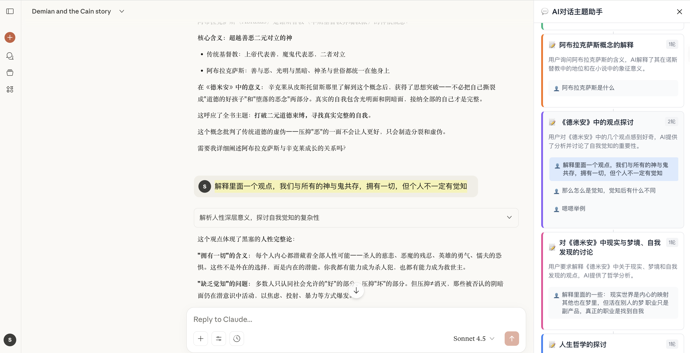

# AI 对话助手 🧠

一个智能的 Chrome 插件，可以自动分析 Claude.ai 对话并生成交互式思维导图，帮助您轻松理解和导航复杂的对话内容。



> 截图展示了插件在 Claude.ai 右侧生成的智能主题助手界面，自动识别了对话中的主要主题并提供快速导航功能。

## ✨ 主要功能

### 🎯 智能主题识别
- **AI 驱动分析**：支持多种 AI 模型（OpenAI GPT、Claude、Kimi、本地模型）
- **用户意图理解**：基于对话上下文和语义关系进行主题划分
- **自适应压缩**：智能处理超长对话，保留关键信息

### 🎨 直观的界面体验
- **悬浮侧边栏**：右侧 350px 可调整宽度面板
- **实时更新**：自动检测新消息并增量分析
- **双向联动**：点击主题跳转对话位置，滚动同步高亮

### 🛡️ 可靠的回退机制
- **问题导航模式**：AI 分析失败时自动切换到问题导航
- **错误处理**：友好的错误提示和重试功能
- **离线使用**：支持本地模型和规则引擎

## 🚀 快速开始

### 安装步骤

1. **下载插件**
   ```bash
   git clone https://github.com/your-username/ai-conversation-assistant.git
   cd ai-conversation-assistant
   ```
   或下载压缩包

2. **加载到 Chrome**
   - 打开 Chrome 浏览器
   - 访问 `chrome://extensions/`
   - 开启"开发者模式"
   - 点击"加载已解压的扩展程序"
   - 选择项目文件夹

3. **配置 AI 服务**
   - 点击插件图标，选择"AI 设置"
   - 选择您的 AI 提供商
   - 输入 API 密钥

### 使用方法

1. **打开 Claude.ai** 并开始对话
2. **点击插件图标** 选择"打开思维导图"
3. **等待分析完成** 侧边栏将显示主题列表
4. **点击主题** 快速跳转到对应对话位置

## ⚙️ 配置选项

### 支持的 AI 服务

| 服务商 | 模型 | 说明 |
|--------|------|------|
| **OpenAI** | GPT-3.5/4 | 需要 OpenAI API 密钥 |
| **Claude** | Claude-3-Haiku | 需要 Anthropic API 密钥 |
| **Kimi** | Moonshot-v1-8k | 需要 Moonshot API 密钥 |
| **本地模型** | Ollama | 本地运行，无需密钥 |

### 设置页面
- **AI 提供商选择**：切换不同的 AI 服务
- **API 密钥管理**：安全存储您的 API 凭证
- **自定义端点**：支持私有部署的 AI 服务
- **性能调优**：温度、令牌数等参数调整

## 🔧 技术架构

### 核心组件
```
├── manifest.json          # Chrome 插件配置
├── background.js          # 后台脚本：AI 分析核心
├── content.js            # 内容脚本：UI 渲染和交互
├── sidebar.css           # 侧边栏样式
├── popup-simple.html     # 插件弹出页面
├── settings.html         # AI 配置页面
└── icons/               # 插件图标资源
```

### 工作流程
1. **DOM 抓取**：智能识别 Claude.ai 页面的对话内容
2. **数据预处理**：清理格式、压缩长文本、建立索引
3. **AI 分析**：调用选定的 AI 服务进行主题识别
4. **结果渲染**：在侧边栏展示主题列表和交互控件
5. **双向联动**：处理用户点击和页面滚动事件

### 智能压缩算法
- **头尾保留**：确保关键开始和结论信息不丢失
- **句子完整性**：在句号边界截断，避免破坏语义
- **关键词识别**：保留包含重要信息的段落
- **自适应长度**：根据对话总长度动态调整压缩率

## 🛠️ 开发指南

### 本地开发
```bash
# 克隆项目
git clone https://github.com/your-username/ai-conversation-assistant.git
cd ai-conversation-assistant

# 在 Chrome 中加载插件
# 1. 打开 chrome://extensions/
# 2. 开启开发者模式
# 3. 加载已解压的扩展程序
```

### 调试方法
- **后台脚本**：在扩展程序页面点击"背景页"
- **内容脚本**：在 Claude.ai 页面按 F12 打开开发者工具
- **弹出页面**：右键插件图标选择"检查弹出内容"

### 文件结构说明
```javascript
// background.js - 核心逻辑
- AI 配置管理
- 主题识别算法
- 网络请求处理
- 错误恢复机制

// content.js - UI 交互
- DOM 元素抓取
- 侧边栏渲染
- 用户事件处理
- 双向联动实现

// sidebar.css - 界面样式
- 响应式布局
- 暗色模式支持
- 动画过渡效果
- 高对比度适配
```

## 🤝 贡献指南

### 提交问题
- 使用 [Issue 模板](https://github.com/your-username/ai-conversation-assistant/issues/new)
- 提供详细的复现步骤
- 包含浏览器版本和插件版本信息

### 功能开发
1. Fork 项目到您的 GitHub
2. 创建功能分支 (`git checkout -b feature/amazing-feature`)
3. 提交更改 (`git commit -m 'Add amazing feature'`)
4. 推送分支 (`git push origin feature/amazing-feature`)
5. 创建 Pull Request

### 代码规范
- 使用 ESLint 进行代码检查
- 遵循现有的代码风格
- 添加必要的注释和文档
- 保持向后兼容性

## 📋 常见问题

### Q: 为什么 AI 分析失败？
**A:** 请检查以下几点：
- API 密钥是否正确配置
- 网络连接是否正常
- API 余额是否充足
- 插件会自动切换到问题导航模式作为备选

### Q: 侧边栏不显示怎么办？
**A:** 请尝试以下解决方案：
- 刷新 Claude.ai 页面
- 检查是否在正确的域名（claude.ai）
- 重新加载插件
- 查看浏览器开发者工具中的错误信息

### Q: 支持其他对话平台吗？
**A:** 目前专为 Claude.ai 优化，但技术架构支持扩展。我们计划在未来版本中支持更多平台。

### Q: 数据安全如何保障？
**A:** 
- **本地优先**：基础功能在本地处理，API 密钥加密存储在浏览器本地
- **透明使用**：AI 分析时会将对话内容发送到您选择的 AI 服务提供商
- **用户控制**：可选择使用本地模型或完全离线的问题导航模式
- **开源透明**：代码完全开源，安全可审计
- 详情请查看 [隐私政策](docs/PRIVACY.md)

## 📄 许可证

本项目基于 [MIT 许可证](LICENSE) 开源。